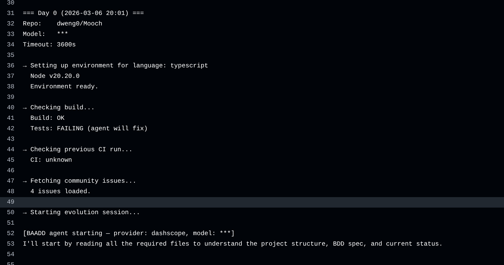
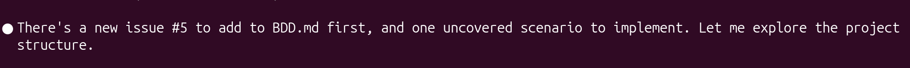
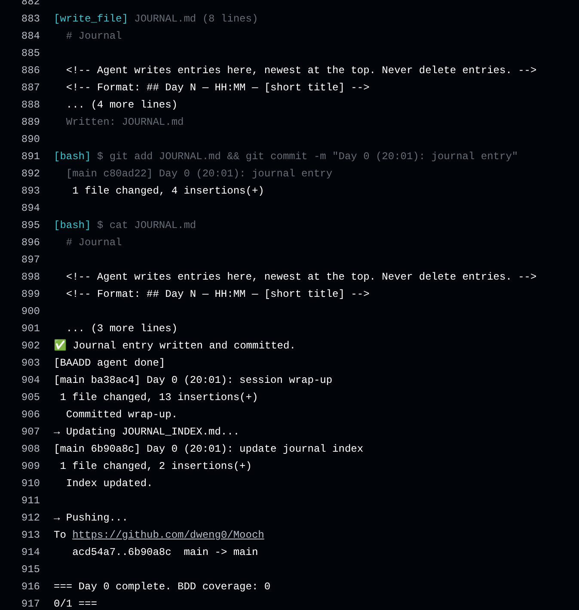
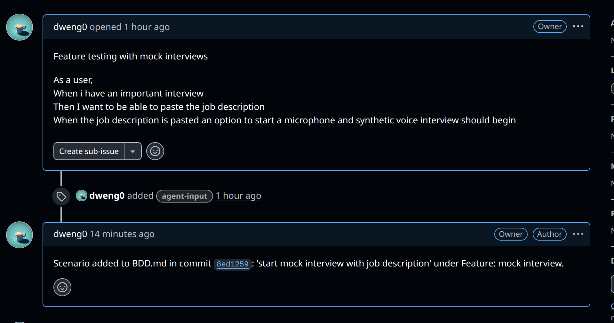

# Meet Mooch

Meet Mooch

## Built BAADD: **B**ehaviour-**A**nd **A**I **D**riven **D**evelopment

Mooch is an interview assistant that can help you. It uses ai to listen to your interviewer and gives you live feedback and suggestions.

## Features

- **Real-time feedback** - Mooch listens to your interviewer, transcribes what they are asking, and provides you with real-time feedback and suggestions on how to answer the question.

- **Passive listening** - Mooch listens to your interviewer and gives you bullet points on questions it hears.

- **Coding help** - Take a screenshot of code you need to work on, provide audio context and watch Mooch generate code suggestions for you.

- **Tailor mooch to each interview** - Provide a job description and your resume for context and Mooch will tailor its suggestions to the specific job you are interviewing for.

- **Works with Claude, OpenAI, Gemini and multiple OpenAI compatible LLMS** - Mooch can use any of these LLMs to provide you with feedback and suggestions.

## Written with BADD

Mooch is built and maintained by an AI agent using Behaviour and AI Driven Development. The agent runs on a schedule, reads the BDD spec, picks up GitHub issues, writes tests, ships code, and closes the loop — no human in the loop required.

**1. The agent wakes up and starts an evolution session**

**2. It reads open issues and turns them into BDD scenarios**

**3. It writes tests, implements the feature, and commits**

**4. It comments on the issue with the commit reference and closes it**

